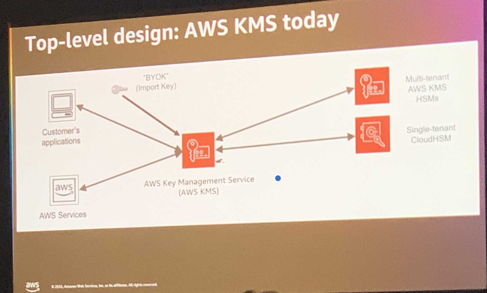
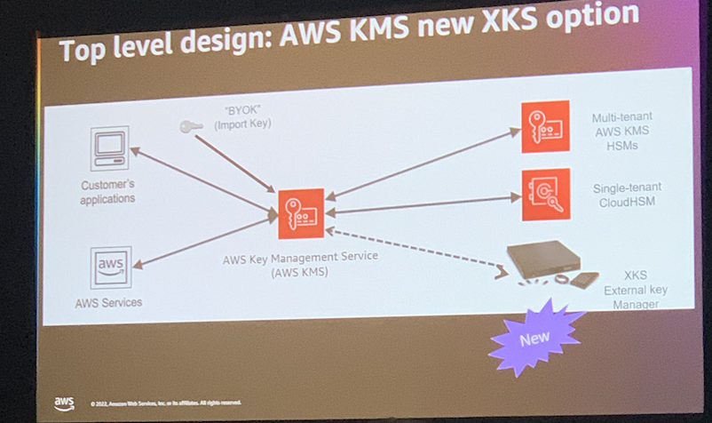
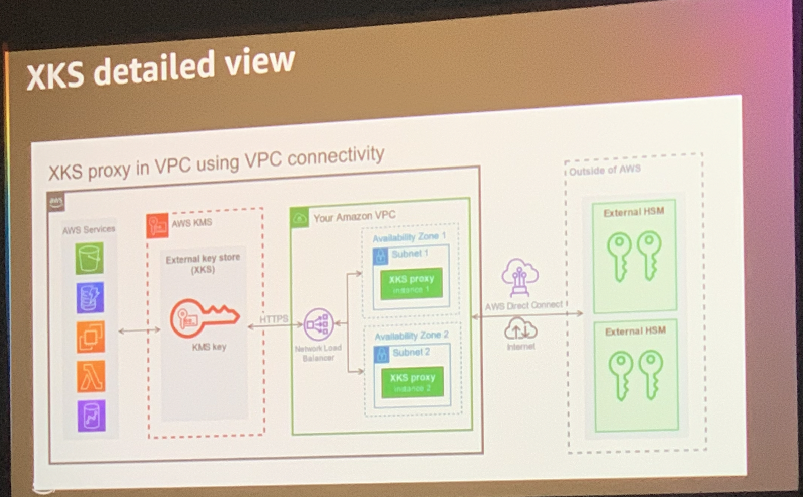
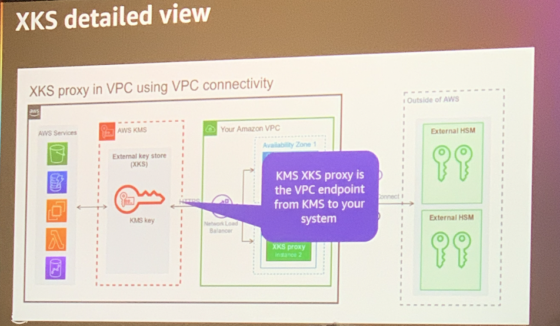
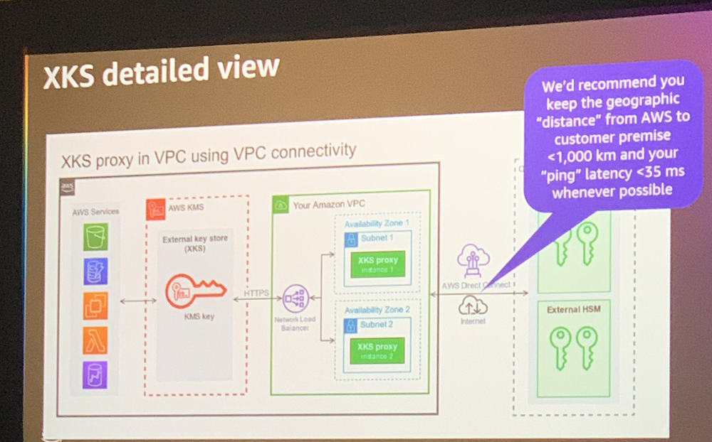
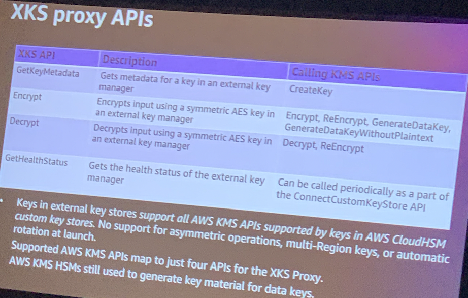
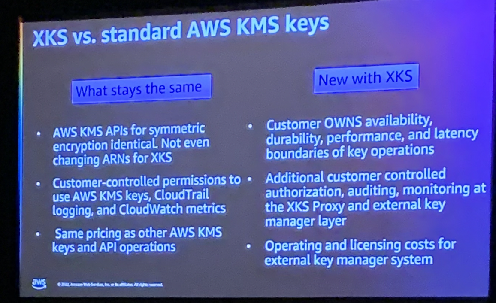

# AWS KMS external keys

- For customers who want to protect their data with encryption keys stored outside of the AWS cloud
- Extends existing AWS KMS custom key store feature beyond AWS CloudHSM (cloud-hosted Hardware Security Module service to host keys) to keys in on-premise HSM

## Highlights:

- Full removal of root of trust from AWS KMS

    - All key material operated from customer's external key manager
    - External visibility and control over every key request

- Transparent to AWS services and client apps
- Flexibility on which keys you choose to store in external key manager
- No AWS KMS lifecycle management of keys kept in customer's HSMs (customer owns, creates, replicates, rotates, deletes external keys)
- Serves as "kill switch": Turn off XKS & AWS data becomes unreadable

## Terminology:

### Custom Key Store:
Logical construct within AWS KMS allows you to replace KMS HSMs with requests to an external key manager outside AWS KMS

- External Key Store (XKS): Custom key store backed by an external key manager
- AWS CloudHSM Key Store: Custom key store backed by AWS CloudHSM

### External Key Manager:
HSM capable of generating keys and supporting cryptographic operations. Vendors developing XKS products: Thales, Entrust, Atos, HashiCorp, Fortanix.

### XKS Proxy:
Architectural component responsible for connecting and communicating AWS KMS requests to external key managers

## XKS API

## XKS v Standard AWS KMS

Official doc: https://aws.amazon.com/blogs/aws/announcing-aws-kms-external-key-store-xks/

