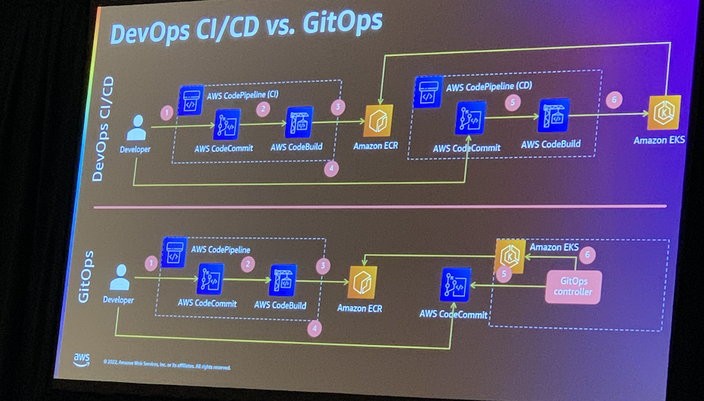

Workshop link: https://catalog.us-east-1.prod.workshops.aws/workshops/ca9c9103-adee-46d9-bf91-f0e8d5e21b1b/en-US/introduction#gitops-vs-iac

Tech lookup:

# Flux

Flux is a set of continuous and progressive delivery solutions for Kubernetes that are open and extensible. Flux is a tool for keeping Kubernetes clusters in sync with sources of configuration (like Git repositories), and automating updates to configuration when there is new code to deploy. Flux is constructed with the GitOps Toolkit, a set of composable APIs and specialized tools for building Continuous Delivery on top of Kubernetes.

# AWS Controllers for Kubernetes (ACK)

AWS Controllers for Kubernetes lets you define and use AWS service resources directly from Kubernetes. With ACK, you can take advantage of AWS-managed services for your Kubernetes applications without needing to define resources outside of the cluster or run services that provide supporting capabilities like databases or message queues within the cluster. ACK provides Kubernetes native experience of defining and managing AWS infrastructure (IaC). You can combine ACK, and GitOps to manage AWS infrastructure at ease just like any applications.